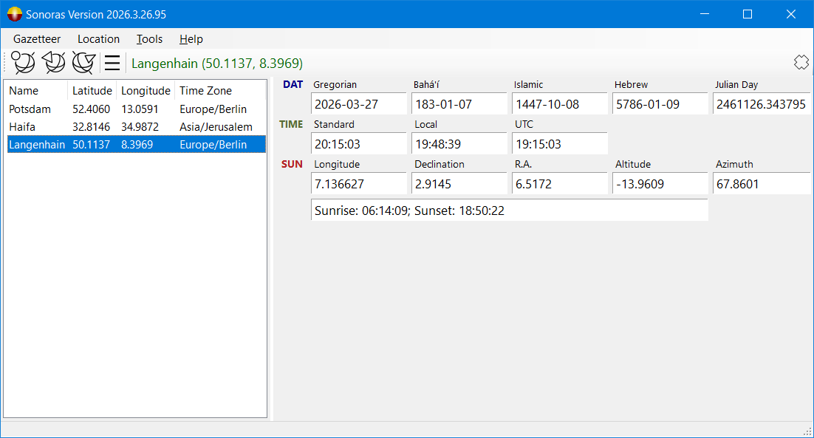
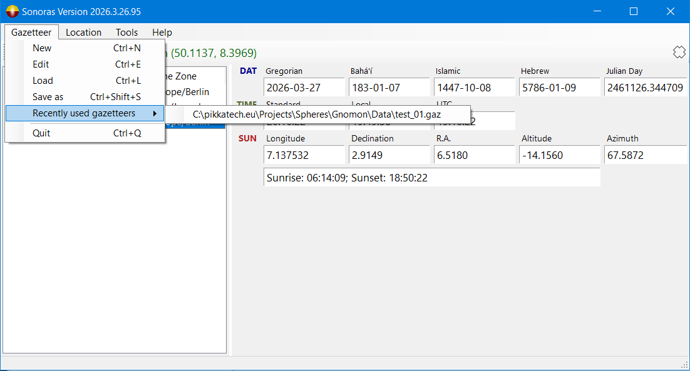
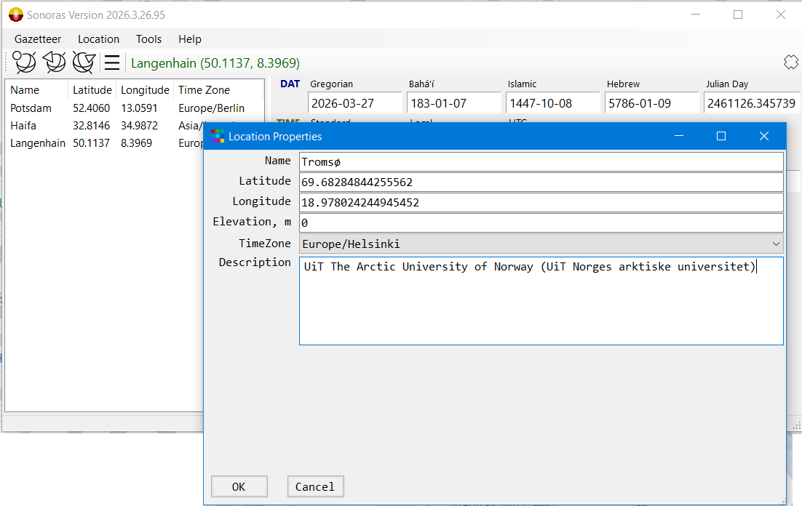
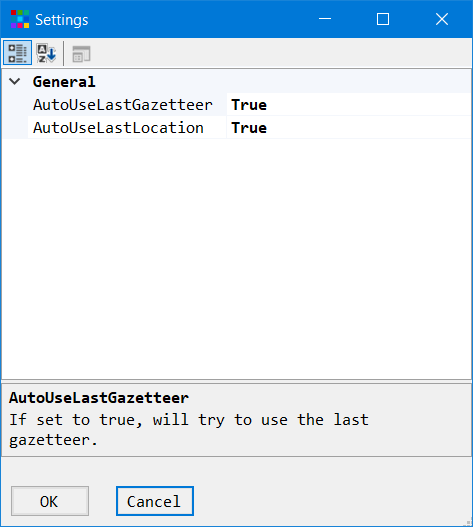

# Sonoras
lightweight framework and application 
for calculation of sun positions and solar events (sunrises, sunsets)

## Overview

**Sonoras** is a lightweight, portable sun positions and solar events calculator designed for personal use.

---

## Features

* Sonoras calculates current sun positions in ecliptic, equatorial, and horizontal coordinates for a selected locality.
* Sonoras displays current date in Gregorian, Bahá'í, Islamic and Hebrew calendars, as well as Juilian Day.
* Localities are gathered in user-defined gazetteers: user can add, edit, remove and select geographical locations that are of interest to them.
* Gazetteers are stored as Json files and can be created, loaded and stored under new file names.
* All calculations are performed based upon equations from:
  * Reingold, Edward M., and Nachum Dershowitz. Calendrical Calculations: The Ultimate Edition. Cambridge University Press, 2018
  * Meeus, Jean. Astronomical Algorithms. 2nd edition. Willmann-Bell, 1998.
* Theoretical precision of calculations: ± 0.02 degrees for angles; ±30 s for sunrises and sunsets.
* Testing and verification of values were carried out by comparison of values with those provided by the REST API of United States Naval Observatory (https://aa.usno.navy.mil/api/rstt/).

---

## Screenshots

Overview

Gazetteer management

Adding a location
---

## Installation

1. Download the executable (`Sonoras_Setup-XXXX.exe`) and place it in any folder.
2. Run `Sonoras_Setup-XXXX.exe` → extracts all necessary .exe and .dll files into that folder.
3. Create or load a gazetteer file.
4. Select a location - the presentation starts immediately.

---

## Usage
* Menu Gazetteer
  * New → Opens a gazetter properties dialog to create a gazetteer. After clicking on OK it will be stored under file name selected.
  * Edit → Opens a gazetter properties dialog with to eventually edit the name and the description od the curren gazetteer.
  * Load → Loads an existing gazetteer from a file. Gazetteers are stored in Json format with the standard extention `.gaz`.
  * Save as → Saves current gazetteer under a new file name.
  * Recently used gazetteers → Displays a list of gazetteers recently used. By selecting one of them it will be automatically loaded.
  * Quit → Quits the program.
  
* Menu Location
  * Add → Opens Location dialog to enter the data of a new location.
  * Edit → Opens Location dialog with the values of currently selected location to eventually correct one of its parameters.
  * Remove → Removes selected locality from current gazetteer.

* Menu Tools
  * Settings → Opens Settings dialog.
  
  
  
  At the moment there are only two settings parameters that define if the last used gazetteer and the last used location should be automatically loaded and selected.
  * Altitude curve → comes in a future version.
  * Solar events → A list of sunrises and sunsets for a Gregoriasn year and a location → comes in a future version.

---

## Roadmap / Future Enhancements

* Graphical representation of sun altitude, azimuth and ecliptic longitude.
* Internationalization
* Enhanced Location dialog with a map control 
* Calculation of lists of sunrises and sunsets for a location and a time interval (such as e.g. Bahá'í fast and Ramadan)
* Enhanced presentation of calendar dates using month names (latinized and in native script)
* Optional dark/light theme

